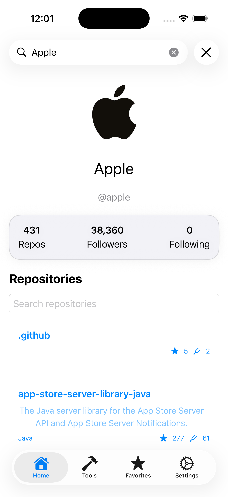
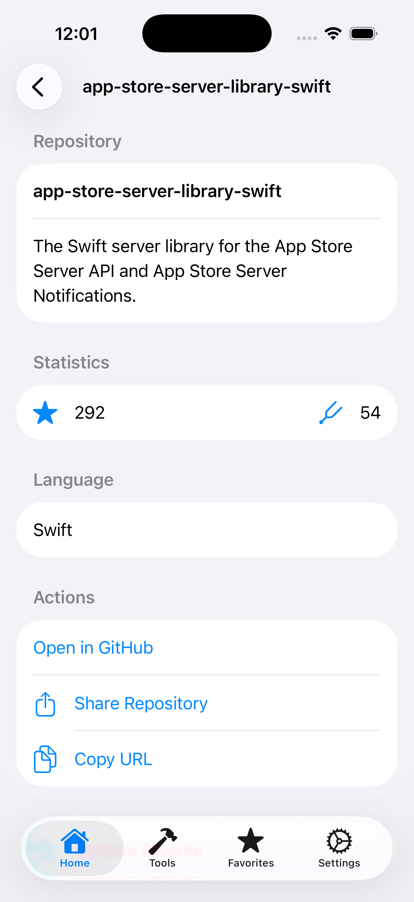
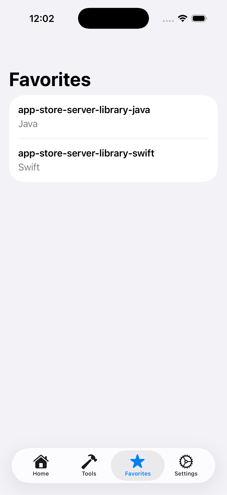
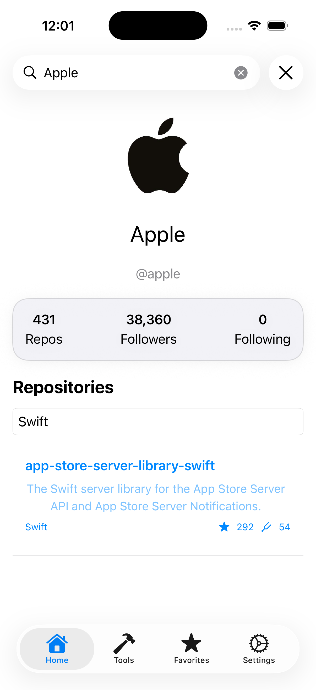

# DevHubAI

A modern SwiftUI portfolio project built to showcase iOS development skills, software architecture, and Apple ecosystem technologies.

Built with SwiftUI, SwiftData, Observation, and GitHub REST API.

## Overview

DevHubAI is a developer-focused application built with SwiftUI and modern Apple frameworks.

The project demonstrates:

* SwiftUI
* MVVM Architecture
* Observation Framework
* SwiftData
* Async/Await
* URLSession Networking
* GitHub REST API Integration
* Reusable Design System Components
* Modular Project Structure

The long-term goal is to support:

* iPhone
* iPad
* macOS
* visionOS

from a shared SwiftUI codebase.

## Features

### GitHub Integration

* Search GitHub users
* View public repositories
* Repository details
* Open repository in GitHub
* Share repository links
* Copy repository URLs

### Favorites

* Save repositories locally
* SwiftData persistence
* Delete favorites
* Offline access to saved repositories

### Search Experience

* Debounced user search
* Repository filtering
* Empty state handling
* Error state handling
* Loading state management

## Architecture

```text
App
├── Core
│   ├── Models
│   ├── Extensions
│   └── Utilities
│
├── Features
│   ├── Dashboard
│   ├── DeveloperTools
│   ├── Favorites
│   └── Settings
│
├── Network
├── Storage
│
└── DesignSystem
    ├── Components
    ├── Theme
    └── Extensions
```
     
## Technologies

* Swift 6
* SwiftUI
* Observation
* SwiftData
* URLSession
* GitHub API
* Git
* GitHub

## Roadmap

### Completed

* Project Architecture
* GitHub User Search
* GitHub Repository List
* Repository Details
* Repository Actions
* Repository Filtering
* Favorites with SwiftData
* Design System Components
* Debounced Search

### Planned

* iPad Optimization
* macOS Support
* visionOS Exploration
* Developer Toolbox

## Screenshots

### Dashboard



### Repository Detail



### Favorites



### Repository Search



## Author

Mobile Application Developer

• SwiftUI
• Kotlin Multiplatform
• Android
• iOS
• macOS
